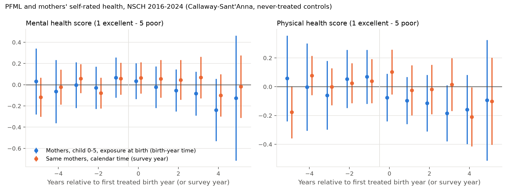
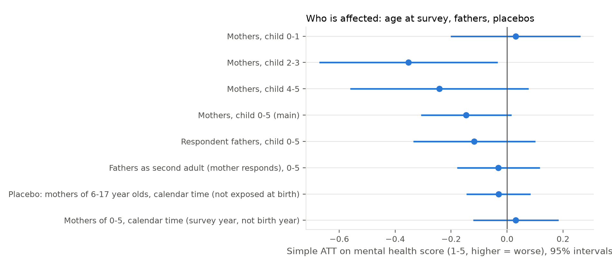

# Paid family leave at birth and parents' mental health 1-5 years later: NSCH results

Design: `docs/nsch_design.md`. Data: NSCH topical files 2016-2024
(`data/raw/NSCH_SPEC.md`), built by `python/20_build_nsch.py` into
`data/clean/nsch_children.csv.gz` (386,083 sampled children, birth years
1999-2024). Estimator: Callaway-Sant'Anna group-time ATTs with the child's
birth year as the time index and the state's first birth year with at least
six months of PFML benefits as the cohort (`python/02_csdid.py --data nsch`),
never-treated controls, base period the last pre-policy birth year, state
block bootstrap with 299 draws. Runs: `python/21_run_nsch.py`; tables:
`output/tables/nsch_summary.md`; every run's event, cohort, calendar and
simple aggregates are in `output/tables/nsch_*`.

Sample for the headline: respondent is the child's mother, child aged 0-5,
births 2010-2024, mental-health item answered: 76,687 children. Cohorts with
a pre-period in this window are Rhode Island (2014), New York (2018),
Washington (2020), DC and Massachusetts (2021), Connecticut (2022) and
Oregon and Colorado (2024; 42 exposed children, so effectively unidentified).
California and New Jersey are always-treated in the birth window and drop
out. Never-treated: 41 states (Delaware, Minnesota and Maryland, whose
benefits start after the last survey, are coded never-treated). Treated
states contribute 1,300-2,400 mothers of 0-5 year olds each across all birth
years, so the estimates are far less precise than the CPS ones.

## 1. Headline

Mothers of children born after paid leave became available report better
mental health when the child is 2-5 years old, by about 0.15 points on the
1-5 scale (0.16 standard deviations), with the gain at the "excellent" margin
rather than at fair/poor. The estimate is marginal in the full sample (p about
0.08), stronger and significant in the 2019-2024 surveys where the birth year
is reported rather than imputed, and concentrated among lower-income and
less-educated mothers. Two things stop it being a clean mental-health result:
the mother's self-rated *physical* health moves by as much, and half of the
estimate comes from New York. Fathers show a smaller, imprecise effect in the
same direction. Parenting stress, emotional support, employment,
breastfeeding and the child's health do not move.

Simple ATT, mothers of children 0-5 (pre-period mean of the treated cohorts
in the first column; `output/tables/nsch_summary.md`):

| Outcome | Pre mean | ATT | s.e. |
|---|---|---|---|
| Mental health score, 1 excellent - 5 poor | 2.03 | -0.146 | 0.082 |
| Mental health fair/poor | 0.060 | -0.003 | 0.021 |
| Mental health excellent | 0.321 | +0.078 | 0.050 |
| Physical health score, 1-5 | 2.02 | -0.197 | 0.077 |
| Parenting stress score (three items, 1 never - 5 always) | 1.65 | +0.027 | 0.054 |
| Any stress item usually/always | 0.042 | +0.008 | 0.011 |
| Coping "not very well" or "not well at all" | 0.015 | +0.015 | 0.008 |
| Has someone to turn to for emotional support | 0.832 | -0.038 | 0.042 |
| Employed (2020-2024 surveys) | 0.687 | -0.034 | 0.046 |
| Employed full-time | 0.506 | -0.013 | 0.054 |
| Child health fair/poor | 0.007 | -0.005 | 0.009 |
| Child had a preventive visit in the past 12 months | 0.980 | -0.022 | 0.015 |
| Ever breastfed | 0.889 | -0.036 | 0.040 |
| Breastfed 26 weeks or more (or still breastfeeding) | 0.550 | -0.017 | 0.050 |

The employment null replicates the CPS result in a different survey. The
breastfeeding nulls are imprecise: the interval on "ever breastfed" spans
-11 to +4 points, so it neither confirms nor contradicts the PRAMS gains
in Wells et al. (2026).

## 2. Event study and cohorts

Birth-year event time (blue): the five pre-policy birth cohorts are within
plus or minus 0.07 points of zero for both scores. Post-policy estimates
move down gradually, reaching -0.24 (s.e. 0.15) for the mental-health score
and -0.16 (0.12) for physical health four birth years after the first treated
one. The e = 4 point is New York births in 2022 plus a handful of Washington
births in 2024, and e = 5, 6 are single small cells (excluded from the
figure). By cohort: New York -0.18 (0.11), Washington -0.09 (0.13), DC and
Massachusetts -0.14 (0.19), Connecticut +0.15 (0.18), Rhode Island -0.05
(0.14), Oregon and Colorado +0.75 (0.29) on 42 children. The sign is shared
by the four cohorts with any post-period to speak of; the magnitude rests on
New York.

Calendar time (orange): the same mothers re-indexed by survey year, with the
state's cohort defined by the calendar year benefits started. This asks
whether mothers of young children in treated states report better health
after the policy regardless of whether their child was born under it. The
answer is no: +0.03 (0.08) for mental health, -0.02 (0.08) for physical.
Whatever moves is tied to the child's birth cohort, not to the survey date.

## 3. Who is affected: age at survey, fathers, placebo

| Sample | Score ATT | s.e. | Fair/poor ATT | s.e. | n |
|---|---|---|---|---|---|
| Mothers, child 0-1 | +0.031 | 0.119 | +0.040 | 0.021 | 18,808 |
| Mothers, child 2-3 | -0.353 | 0.163 | -0.079 | 0.043 | 29,723 |
| Mothers, child 4-5 | -0.242 | 0.163 | -0.019 | 0.058 | 28,156 |
| Mothers, child 0-5 (main) | -0.146 | 0.082 | -0.003 | 0.021 | 76,687 |
| Respondent fathers, child 0-5 | -0.117 | 0.112 | -0.044 | 0.027 | 35,753 |
| Fathers as the second adult, mother responding, 0-5 | -0.031 | 0.076 | | | 65,022 |
| Placebo: mothers of 6-17 year olds, calendar time | -0.031 | 0.059 | | | 58,567 |

Within child-age bands the survey year moves one-for-one with the birth year,
so these are the cleanest comparisons. There is nothing at ages 0-1 (the
PRAMS window is 2-6 months, so this is not a direct replication) and the
effect is at ages 2-3 and 4-5. Respondent fathers of 0-5 year olds show
-0.12 (0.11) on the score and -4.4 points (2.7) on fair/poor; the mother's
report of the second adult's mental health shows nothing. Mothers of
children born before the policy but surveyed after it (ages 6-17, calendar
time) are a precise zero on both mental and physical health, so a state-level
shock to how parents rate their health is ruled out at the scale that would
be needed to produce the 0-5 estimate.

## 4. Robustness

| Specification | Score ATT | s.e. | Excellent ATT | s.e. | Physical ATT | s.e. |
|---|---|---|---|---|---|---|
| Main | -0.146 | 0.082 | +0.078 | 0.050 | -0.197 | 0.077 |
| Not-yet-treated controls | -0.139 | 0.083 | | | | |
| Base period g-2 (births in g-1 can take bonding leave in g) | -0.073 | 0.088 | | | | |
| Birth year = survey year minus age, all years | +0.039 | 0.089 | | | | |
| Drop the 2020 and 2021 surveys | -0.109 | 0.093 | | | | |
| Surveys 2019-2024 only (reported birth year) | -0.250 | 0.094 | +0.134 | 0.046 | | |
| Drop New York | -0.075 | 0.088 | | | -0.120 | 0.084 |

Two of these matter. First, birth-year measurement: in the 2016-2018 files
the birth year is survey year minus age, which overstates the true birth
year for 38 percent of children (checked against the reported birth year
from 2019). Using that rule everywhere gives zero; restricting to surveys
with a reported birth year gives -0.25 (0.09) and +13 points (4.6) on
"excellent". The signal is where exposure is measured accurately. Second,
New York: without it the score estimate halves and the physical-health
estimate falls by 40 percent, with intervals that include zero.

## 5. Heterogeneity

| Subgroup | Score ATT | s.e. |
|---|---|---|
| Family income below 200% of poverty | -0.311 | 0.165 |
| Family income 200% of poverty or more | -0.048 | 0.105 |
| Less than a bachelor's degree | -0.216 | 0.167 |
| Bachelor's degree or more | -0.024 | 0.098 |
| Married | -0.147 | 0.093 |
| Not married | -0.051 | 0.160 |
| White non-Hispanic | -0.115 | 0.110 |
| Hispanic | -0.181 | 0.217 |
| Black | -0.032 | 0.378 |

The gradient by income and education is what a paid-leave mechanism
predicts (the mothers for whom unpaid FMLA leave is unaffordable), and it is
the opposite of the CPS labour-supply pattern, where only white mothers
moved. The race cells are too small to say anything.

## 6. Reading

The NSCH gives a suggestive, not a settled, result. On the side of a real
effect: flat pre-trends in birth-cohort time; the calendar-time placebos are
zero, so the estimate is not a contemporaneous state shock; the effect is
where exposure is measured well and among the mothers for whom paid leave
binds; fathers move in the same direction. Against: the mother's physical
health moves as much as her mental health, which reads as a general
self-rated-health response (or a reporting one) rather than the
depression channel Wells et al. document; the fair/poor margin, the closest
analogue to depressive symptoms, does not move; and the magnitude depends on
one large early-adopting state. With 299 bootstrap draws and seven treated
clusters the standard errors are themselves rough; the Stata version
(`stata/21_csdid_nsch.do`, `drimp` with survey-year and age covariates,
state-clustered wild bootstrap) is the inference to report.

What would sharpen it: the 2025 NSCH file (a second post-birth-year for
Connecticut and first ones for Oregon and Colorado); exact exposure from
`BIRTH_MO` in the 2019-2024 files instead of the six-month cohort rule;
randomisation inference over placebo cohorts assigned to never-treated
states; and a general-health outcome in PRAMS or the ACS as an external
check on the physical-health finding.
