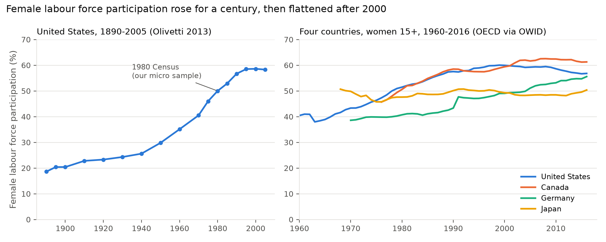
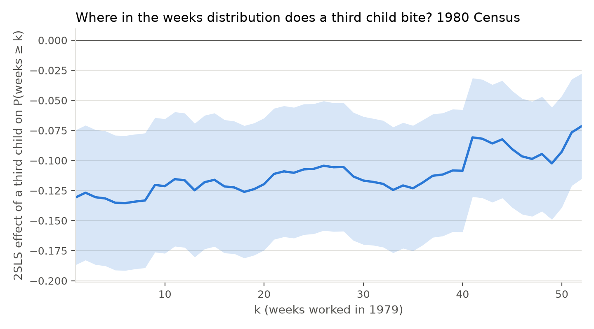
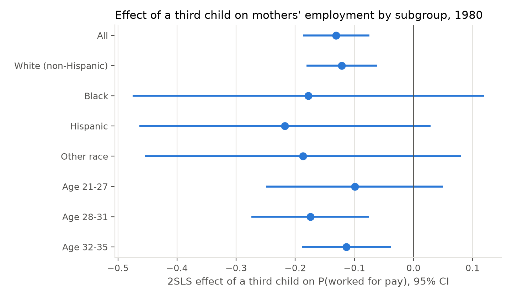
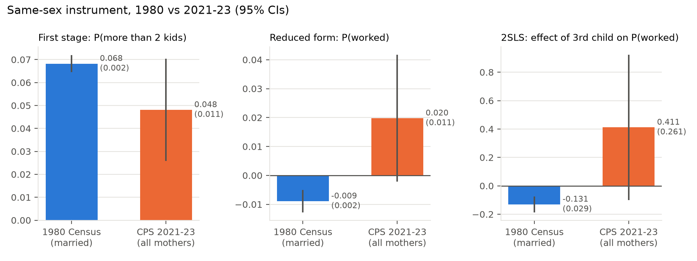

# Preliminary results

All numbers come from `output/tables/` (produced by `code/03_analysis.py`).
Standard errors are heteroskedasticity-robust; CPS estimates use household
weights. Stars: * 10%, ** 5%, *** 1%.

## 1. Motivation

US female participation rose from under 20% in 1890 to about 60% by 2000 and has
been flat since, while Canada and Germany kept rising. The 1980 Census sits in the
middle of the steep post-war climb; the 2020s sit on the plateau. Whether the
labour-supply cost of an extra child changed over this period is the question.

## 2. Samples

| | 1980 Census, married | 1980 Census, Black/Hispanic | CPS 2021-23, all mothers | CPS 2021-23, married |
|---|---|---|---|---|
| N | 254,654 | 31,857 | 9,171 | 6,559 |
| More than 2 children | 0.381 | 0.491 | 0.459 | 0.452 |
| First two children same sex | 0.506 | 0.503 | 0.499 | 0.502 |
| Worked for pay last year | 0.528 | 0.590 | 0.689 | 0.656 |
| Weeks worked | 19.0 | 22.7 | | |
| Usual weekly hours | | 21.2 | 22.3 | 21.4 |
| Age | 30.4 | 29.7 | 31.2 | 31.5 |
| Age at first birth | | 20.1 | 22.0 | 22.8 |

Mothers aged 21-35 with two or more own children, second child at least one year
old. The 1980 means match Angrist and Evans (1998) Table 2 to three decimals,
which confirms the extract is their married-women sample. The modern CPS sample
is small: three ASEC files, 92% of target mothers retained after requiring the
within-family child assignment to reproduce the ASEC own-children count exactly
(`output/tables/cps_pe_linkage.csv`).

## 3. First stage: the same-sex effect on fertility persists but is weaker

| Sample | Same sex (with controls) | Robust F | Two boys | Two girls | p: boys = girls |
|---|---|---|---|---|---|
| 1980 married | 0.068*** (0.002) | 1,288 | 0.059*** (0.003) | 0.078*** (0.003) | 0.000 |
| 1980 Black/Hispanic | 0.057*** (0.005) | 118 | 0.053*** (0.007) | 0.062*** (0.008) | 0.410 |
| CPS 2021-23, all mothers | 0.048*** (0.011) | 18 | 0.055*** (0.016) | 0.041** (0.016) | 0.526 |
| CPS 2021-23, married | 0.041*** (0.013) | 10 | 0.035* (0.018) | 0.047** (0.019) | 0.664 |

In 1980 two girls raise the probability of a third child more than two boys
(0.078 vs 0.059), the son-preference asymmetry Angrist and Evans documented. In
2021-23 the pooled effect is 0.048, about 30% smaller than in 1980 (difference
0.020, s.e. 0.011), and the boy/girl asymmetry is no longer detectable, though the
CPS cannot distinguish 0.041 from 0.055.

## 4. OLS versus 2SLS

| Sample | Outcome | Mean | OLS | 2SLS (same sex) | 2SLS (two boys + two girls) | Sargan p |
|---|---|---|---|---|---|---|
| 1980 married | Worked for pay | 0.528 | -0.129*** (0.002) | -0.131*** (0.029) | -0.120*** (0.028) | 0.008 |
| 1980 married | Weeks worked | 19.0 | -6.23*** (0.09) | -5.81*** (1.24) | -5.46*** (1.23) | 0.050 |
| 1980 Black/Hispanic | Worked for pay | 0.590 | -0.165*** (0.006) | -0.188** (0.092) | -0.186** (0.092) | 0.776 |
| 1980 Black/Hispanic | Hours per week | 21.2 | -6.14*** (0.22) | -5.83 (3.67) | -5.61 (3.67) | 0.429 |
| 1980 Black/Hispanic | Labour income ($1000s) | 8.5 | -3.96*** (0.13) | 0.86 (2.16) | 0.97 (2.16) | 0.479 |
| CPS 2021-23, all mothers | Worked for pay | 0.689 | -0.107*** (0.012) | 0.41 (0.26) | 0.46* (0.27) | 0.157 |
| CPS 2021-23, all mothers | Hours per week | 22.3 | -5.63*** (0.47) | 3.2 (9.5) | 5.5 (9.5) | 0.069 |
| CPS 2021-23, married | Worked for pay | 0.656 | -0.121*** (0.014) | 0.64 (0.41) | 0.51 (0.38) | 0.006 |

Three things stand out.

* **Replication.** The 1980 two-instrument estimates (-0.120 on employment, -5.46
  weeks) are the Angrist-Evans married-women numbers. OLS and 2SLS coincide for
  the extensive margin in 1980, so selection into fertility does not bias OLS
  much there; for the Black/Hispanic subsample the IV effect on labour income is
  zero while OLS is strongly negative, a sign that OLS overstates income losses.
* **The modern 2SLS is uninformative.** The 2021-23 point estimates are positive
  with standard errors of 0.26-0.41. The minimum detectable effect on employment
  is 0.73 at 80% power. OLS in the 2020s (-0.107) is close to the 1980 OLS, but
  OLS is not the causal parameter. This is exactly why the paper needs the ACS.
* **Overidentification rejects in 1980.** Two boys and two girls give different
  LATEs (next section).

## 5. Two boys versus two girls (1980, married mothers)

| Outcome | LATE, two boys | LATE, two girls | Overidentified 2SLS | Sargan p |
|---|---|---|---|---|
| Worked for pay | -0.217*** (0.047) | -0.063* (0.036) | -0.120*** (0.028) | 0.008 |
| Weeks worked | -8.60*** (2.02) | -3.60** (1.55) | -5.46*** (1.23) | 0.050 |

Mothers induced to have a third child by two boys withdraw from work three times
as much as those induced by two girls. Both instruments are randomly assigned, so
the discrepancy means either the two complier groups have different treatment
effects (families that "try for a girl" differ from those that "try for a boy")
or sex composition affects labour supply directly, violating exclusion. In the
Black/Hispanic subsample the two LATEs are similar (-0.21 vs -0.16, p = 0.78).
The published same-sex LATE is a weighted average of these two numbers. Which
interpretation holds is a central question for the paper; the ACS data allow the
test to be repeated by decade and with fathers' outcomes as placebo.

## 6. Where the effect bites: distribution of weeks

The 2SLS effect of a third child on P(weeks >= k) is about -0.13 for every
threshold up to 40 weeks and shrinks toward -0.07 at full-year work. The child
moves mothers from any work to no work rather than trimming weeks among those who
keep working, so the extensive margin is the headline outcome for the paper.

## 7. Heterogeneity

| Panel | Group | N | First stage | LATE on worked |
|---|---|---|---|---|
| 1980 married | Age 21-27 | 53,765 | 0.056 | -0.099 (0.076) |
| 1980 married | Age 28-31 | 87,779 | 0.066 | -0.174*** (0.051) |
| 1980 married | Age 32-35 | 113,110 | 0.076 | -0.113*** (0.038) |
| 1980 Black/Hispanic | Education < 12 | 11,986 | 0.053 | -0.055 (0.169) |
| 1980 Black/Hispanic | Education = 12 | 12,552 | 0.063 | -0.432*** (0.137) |
| 1980 Black/Hispanic | Education > 12 | 7,319 | 0.054 | 0.033 (0.188) |
| 1980 Black/Hispanic | First birth at 20-22 | 10,686 | 0.053 | -0.408** (0.176) |
| 1980 Black/Hispanic | Other income, middle tercile | 10,620 | 0.058 | -0.263* (0.156) |

Effects by race are similar within noise. The employment effect is concentrated
among high-school graduates and mothers whose first birth was in their early
twenties, and absent for both the least and most educated. The hours effect for
high-school graduates is -16.9 hours (s.e. 5.4). This profile is consistent with
a model where the marginal mother is one whose wage is close to the cost of
childcare.

## 8. Who are the compliers?

| Characteristic | Population share | Complier share | Relative likelihood |
|---|---|---|---|
| White (non-Hispanic) | 0.848 | 0.874 | 1.03 |
| Black | 0.052 | 0.039 | 0.75 |
| Age 21-27 | 0.211 | 0.171 | 0.81 |
| Age 32-35 | 0.444 | 0.499 | 1.12 |
| First child a boy | 0.514 | 0.441 | 0.86 |
| Other income, bottom tercile (B/H sample) | 0.333 | 0.248 | 0.74 |

Compliers are older and more likely white than the average mother, and less
likely to be in the poorest third of families. The LATE therefore under-represents
young and low-income mothers, which matters for policy interpretation.

## 9. Instrument validity check

The Kitagawa (2015) inequalities, which any valid binary instrument must satisfy
for every outcome set, hold in all twelve (treatment status x weeks bin) cells:
every difference is positive with t-statistics between 4 and 23 and the
bootstrap p-value for a violation is 1.00 (`output/tables/T7_kitagawa_1980_weeks.md`).
The test has power against gross exclusion failures but not against the
two-boys/two-girls discrepancy, which concerns two instruments jointly.

## 10. 1980 versus the 2020s

| Comparison | First stage 1980 | First stage 2020s | LATE 1980 | LATE 2020s | Difference |
|---|---|---|---|---|---|
| Married 1980 vs all mothers 2021-23 | 0.068 (0.002) | 0.048 (0.011) | -0.131*** (0.029) | 0.43 (0.28) | 0.56** (0.28) |
| Married 1980 vs married 2021-23 | 0.068 (0.002) | 0.041 (0.013) | -0.131*** (0.029) | 0.65 (0.42) | 0.78* (0.42) |
| Black/Hispanic, hours | 0.057 (0.005) | 0.042 (0.019) | -5.8 (3.7) | -6.8 (17.2) | -1.0 (17.6) |

The pooled interaction test flags a difference, but it is driven entirely by an
imprecise and implausibly large positive modern estimate; the honest reading is
that the CPS sample can establish the first stage and nothing about the LATE. The
comparison table is the template the ACS extract will fill.

## 11. What would make this publishable

1. Full-power estimates by decade, 1980-2023, from IPUMS (script ready).
2. Resolve the two-boys/two-girls discrepancy: test it in every decade, add
   fathers' outcomes and household earnings, and interpret through the
   Mogstad-Torgovitsky-Walters framework.
3. Add the twins instrument as a second complier population.
4. Interact the LATE with state childcare costs and paid-leave adoption in the
   ACS years.
