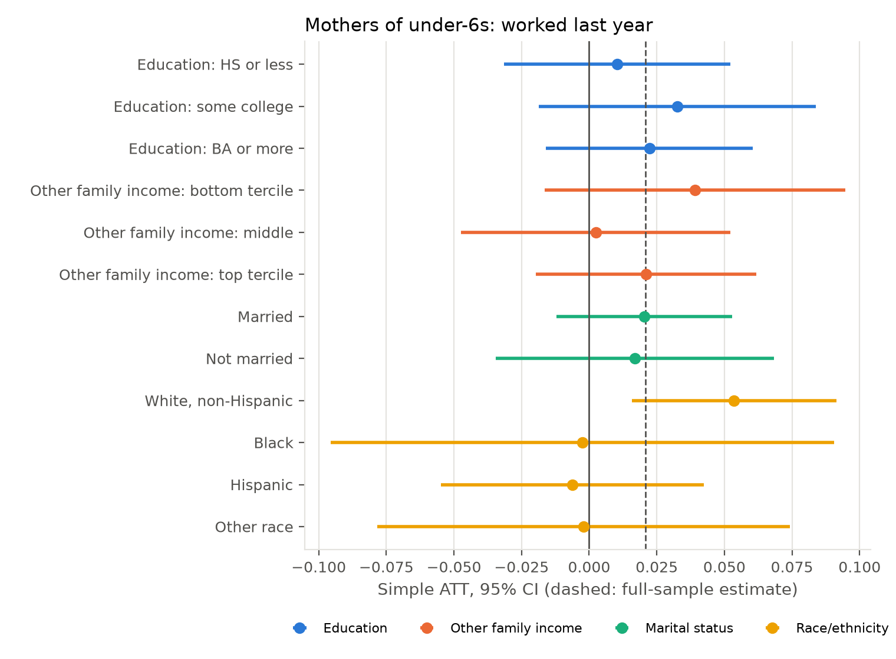

# Results: PFML and mothers' labour supply, CPS ASEC 1990-2025

Data: IPUMS-CPS ASEC extract `cps_00090` (all persons, survey years 1990-2025),
restricted to women aged 18-44: 1,216,812 person-years, reference years
1989-2024, about 10,500 mothers of children under 6 per year. Built by
`python/01_build_ipums_asec.py`; estimated by `02_csdid.py` through
`03_run_all.sh`; assembled by `04_summarise.py`. Tables are in
`output/tables/`, figures in `output/figures/`.

Estimator: Callaway and Sant'Anna (2021) group-time ATTs on repeated cross
sections, cohorts = first reference year with at least six months of PFML
benefits (CA 2004, NJ 2009, RI 2014, NY 2018, WA and DC 2020, MA 2021, CT
2022, OR 2023, CO 2024; DE, MN, MD recoded to never-treated), never-treated
controls (not-yet-treated as a check), no covariates, varying base period,
ASEC person weights. Standard errors: block bootstrap over never-treated states
with within-state resampling of treated cohorts, 499 draws. Stars: * 10%,
** 5%, *** 1%. The Stata `csdid` pipeline (`stata/`) runs the same
design with doubly-robust covariate adjustment and a wild cluster bootstrap.

## 1. Headline

| Sample | Outcome | Simple ATT, never-treated | Simple ATT, not-yet-treated | Mean pre e=-5..-1 | Mean post e=0..5 |
|---|---|---|---|---|---|
| Mothers of under-6s | Worked last year | 0.021 (0.014) | 0.019 (0.013) | 0.004 | 0.001 |
| Mothers of under-6s | Usual weekly hours | 0.53 (0.57) | | 0.18 | -0.09 |
| Mothers of under-6s | Full time | 0.003 (0.015) | | 0.005 | -0.010 |
| Mothers of under-6s | In labour force (March) | 0.024 (0.015) | | 0.003 | 0.010 |
| All mothers | Worked last year | 0.007 (0.009) | | 0.002 | -0.004 |
| All mothers | In labour force (March) | 0.011 (0.009) | | 0.002 | 0.002 |
| Childless women (placebo) | Worked last year | 0.011 (0.010) | | 0.002 | 0.010 |
| Childless women (placebo) | Usual weekly hours | -0.03 (0.50) | | 0.12 | 0.07 |

Paid family leave has no detectable effect on mothers' employment, hours, or
full-time work in the first five years after benefits become available. The
simple ATT on employment is +2.1 percentage points with a standard error of
1.4; the 95 percent interval runs from -0.7 to +4.9 points, so effects larger
than about 5 points are ruled out. Pre-treatment coefficients average 0.004
(employment) and 0.18 hours, so the parallel-trends assumption is not
contradicted, and the childless-women placebo is zero throughout.

## 2. Event study

| Event time | Mothers of under-6s: worked | Mothers of under-6s: hours | Childless: worked |
|---|---|---|---|
| -5 | 0.011 (0.014) | 0.07 (0.59) | -0.010 (0.012) |
| -4 | 0.002 (0.015) | 0.49 (0.59) | 0.007 (0.012) |
| -3 | 0.009 (0.014) | 0.25 (0.60) | -0.008 (0.011) |
| -2 | 0.005 (0.015) | 0.41 (0.60) | 0.005 (0.011) |
| -1 | -0.006 (0.016) | -0.30 (0.68) | 0.017 (0.011) |
| 0 | -0.002 (0.015) | -0.31 (0.61) | -0.010 (0.011) |
| 1 | 0.003 (0.016) | 0.36 (0.67) | 0.008 (0.012) |
| 2 | -0.015 (0.016) | -0.52 (0.66) | 0.020* (0.012) |
| 3 | 0.005 (0.016) | -0.19 (0.67) | 0.014 (0.012) |
| 4 | 0.003 (0.019) | 0.02 (0.76) | 0.009 (0.014) |
| 5 | 0.013 (0.019) | 0.12 (0.76) | 0.020 (0.014) |
| 6 | 0.011 (0.019) | 0.16 (0.77) | 0.002 (0.015) |
| 7 | 0.027 (0.020) | 0.99 (0.80) | -0.018 (0.017) |
| 8 | 0.032 (0.020) | 1.01 (0.86) | 0.006 (0.016) |
| 9 | 0.023 (0.023) | 0.72 (0.94) | 0.014 (0.017) |
| 10 | 0.043* (0.022) | 1.61* (0.93) | 0.001 (0.018) |

The coefficients are flat at zero for the first six years and drift upward
from year seven, reaching +4.3 points on employment and +1.6 hours at year
ten (10 percent level). Event times beyond six are identified only by
California (2004) and New Jersey (2009), and beyond ten by California alone,
so the late rise is a California-and-New-Jersey pattern and not a general
finding. One of twenty pre-period coefficients (e = -9) is significant, as
expected by chance.

## 3. Cohort effects

| Cohort | States | Worked ATT | Hours ATT |
|---|---|---|---|
| 2004 | CA | 0.023 (0.018) | 0.41 (0.74) |
| 2009 | NJ | 0.034 (0.034) | 2.28* (1.31) |
| 2014 | RI | 0.041 (0.051) | 1.88 (2.04) |
| 2018 | NY | -0.004 (0.030) | -0.59 (1.20) |
| 2020 | DC, WA | -0.010 (0.038) | -0.94 (1.49) |
| 2021 | MA | 0.023 (0.038) | 3.03* (1.58) |
| 2022 | CT | -0.013 (0.065) | -2.01 (2.88) |
| 2023 | OR | 0.083 (0.063) | 1.91 (2.51) |
| 2024 | CO | -0.022 (0.067) | -0.89 (3.00) |

No cohort shows a significant employment effect. The first-generation
programmes (CA, NJ, RI) have positive point estimates of 2 to 4 points; the
2018-2024 generation, which is more generous, averages about zero but has
one to six post-years and wide intervals. A precise comparison of programme
generations needs the state-cell heterogeneity analysis in `03_robustness.do`
and more years for the late cohorts.

## 4. Raw means

## 5. What this means for the paper

1. **The extensive-margin null is precise enough to matter.** With nine
   cohorts and 35 years the design rules out employment effects above about
   5 points for mothers of pre-schoolers, and the placebo and pre-trends
   behave. This contrasts with the large short-run effects reported for
   California from birth-timed samples and is consistent with PFML acting on
   leave-taking and job continuity around births rather than on the stock of
   employed mothers.
2. **Where to look next.** (a) Mothers of infants (`has_infant`), where the
   policy bites; (b) the March survey-week outcomes (`inlf`, `employed`,
   `hours_now`) that date labour supply after the leave period rather than
   the calendar year it started; (c) covariate-adjusted `drimp` estimates and
   the wild cluster bootstrap in Stata; (d) the long-run rise in CA and NJ
   against Bailey et al.'s negative long-run findings for first-time mothers;
   (e) programme generosity as a moderator once the policy dates and
   parameters are verified.
3. **Caveats.** Reference-year timing assigns the whole calendar year to a
   cohort whose benefits started mid-year (CA, NJ, DC, OR; the
   `gvar_full` variable carries the first full year as a robustness cohort);
   the policy dates were compiled from memory and must be verified; 2014 has
   two ASEC subsamples that are pooled with their weights; standard errors
   come from a state block bootstrap and should be compared with `csdid`'s
   wild cluster bootstrap.

## 6. Exploratory: fertility outcomes (all women 18-44)

Same estimator, sample = all women 18-44 (motherhood is the outcome, so the
sample cannot condition on it), B = 199. Tables `output/tables/all_*`.

| Outcome | Mean | Simple ATT | Mean pre e=-5..-1 | e=0..5 | e=7..10 | CA cohort |
|---|---|---|---|---|---|---|
| Own child under 1 (birth last year) | 0.06 | -0.002 (0.004) | 0.000 | -0.001 | -0.004 | -0.001 (0.005) |
| Any own child | 0.55 | -0.024** (0.009) | 0.001 | -0.010 | -0.031 | -0.034*** (0.011) |
| Number of own children | 1.05 | -0.075*** (0.022) | -0.003 | -0.027 | -0.086 | -0.102*** (0.029) |

The birth proxy is a precise zero at every horizon (s.e. 0.004 on a base of
6 percent). The negative effects on the stock of children appear only from
year 7 on and only in California, the one cohort observed that long; pre-trends
are flat. A drop in the stock without a drop in the flow of births is not a
fertility response to the policy; it is California's post-2008 fertility
decline (and possibly out-migration of families) showing up against the
never-treated states. Cohorts 2009-2024 are all zero. See the chat note of
2026-09-10 for the design that would be needed to ask the fertility question
properly.

## 7. Heterogeneous effects

`python/05_heterogeneity.sh` re-estimates the headline specification within
subgroups (B = 199); `06_summarise_het.py` collects them in
`output/tables/het_summary.md` and `output/figures/het_worked.png`,
`het_hours.png`, `het_has_infant.png`. Income is measured two ways that are
not outcomes: education (earnings potential, which also determines where a
woman sits relative to each programme's benefit cap) and other family income,
family income minus the woman's own labour income, in within-year terciles.
Stata: `stata/05_heterogeneity.do`.

| Group | Share | Pre-mean, treated | Worked: ATT (s.e.) | Hours: ATT (s.e.) | Pre-trend (worked) |
|---|---|---|---|---|---|
| All mothers of under-6s | 1.00 | | 0.021 (0.014) | 0.53 (0.57) | 0.004 |
| Education: HS or less | 0.42 | 0.525 | 0.010 (0.021) | 0.10 (0.84) | 0.002 |
| Education: some college | 0.29 | 0.667 | 0.033 (0.026) | 0.07 (1.01) | 0.000 |
| Education: BA or more | 0.29 | 0.744 | 0.022 (0.020) | 1.23 (0.86) | 0.004 |
| Other family income: bottom tercile | 0.29 | 0.680 | 0.039 (0.028) | 0.97 (1.17) | 0.001 |
| Other family income: middle | 0.38 | 0.604 | 0.003 (0.025) | -0.03 (1.01) | 0.007 |
| Other family income: top tercile | 0.33 | 0.662 | 0.021 (0.021) | 0.45 (0.87) | 0.003 |
| Married | 0.72 | 0.631 | 0.020 (0.017) | 0.61 (0.71) | 0.004 |
| Not married | 0.28 | 0.692 | 0.017 (0.026) | 0.02 (1.05) | 0.005 |
| White, non-Hispanic | 0.60 | 0.684 | 0.054*** (0.019) | 2.23*** (0.80) | 0.001 |
| Black | 0.13 | 0.690 | -0.003 (0.048) | -0.56 (1.97) | -0.012 |
| Hispanic | 0.20 | 0.576 | -0.006 (0.025) | -0.49 (0.98) | 0.008 |
| Other race | 0.07 | 0.638 | -0.002 (0.039) | 0.06 (1.56) | 0.013 |

**Income, education, marital status: no heterogeneity.** Every education,
other-family-income and marital-status subgroup gives an employment effect
between 0 and +4 points with standard errors of 2 to 3 points, and pre-trends
within 0.01 of zero. The bottom income tercile and women with some college
have the largest point estimates, but none differs from the others by more
than one standard error. If PFML's cash value mattered most where the
replacement rate is highest (low earners) or where a spouse's income makes
leave affordable (high other income), it does not show in employment.

**Race and ethnicity: the whole effect sits with white non-Hispanic
mothers.** +5.4 points on employment (s.e. 1.9) and +2.2 hours (s.e. 0.8),
with flat pre-trends, versus zero for Black, Hispanic and other mothers. The
white effect grows with exposure (+3 points in year 0, +5 to +9 points in
years 5 to 10) and is concentrated in the first two cohorts: California
+7.5 (2.7), New Jersey +4.7 (4.4), with later cohorts imprecise. The
white-minus-Hispanic difference is 6 points (s.e. 3.1). Hispanic mothers show
negative point estimates in years 2 to 6 (-3 to -6 points, s.e. 3), not
significant.

**Reading.** The aggregate near-null is an average of a positive effect for
white mothers and nothing for everyone else, which is the group least likely
to be covered by the programmes' eligibility (earnings history) and most
exposed to job loss after leave. Two explanations need separating before this
becomes a claim: (i) eligibility and take-up, which the CPS cannot observe
directly but can be proxied by prior-year employment and job tenure in the
ORG files; (ii) differential trends by race within California and New Jersey
(housing costs, out-migration of white families with children), which the
childless-women placebo by race would test. Both are one run each with the
existing scripts.

**Fertility by group.** Births show no heterogeneity: every education,
income, marital and racial subgroup is within 1 point of zero (the Hispanic
+1.4, s.e. 0.7, is one of twelve estimates at the 10 percent level).

### 7.1 Two checks on the white-mother effect

**Placebo by race (childless women).** If the white-mother effect were a
white-population trend in California and New Jersey (housing costs,
out-migration), childless white women would show it too. They do not:

| Childless women | Worked: ATT (s.e.) | Pre-trend | CA cohort | NJ cohort |
|---|---|---|---|---|
| White, non-Hispanic | 0.006 (0.013) | 0.001 | 0.015 (0.019) | -0.008 (0.032) |
| Black | -0.004 (0.034) | 0.009 | -0.042 (0.057) | 0.091 (0.071) |
| Hispanic | 0.000 (0.022) | 0.000 | 0.001 (0.028) | 0.008 (0.055) |
| Other | 0.036 (0.031) | 0.002 | 0.048 (0.041) | 0.064 (0.096) |

Hours are likewise zero (white: -0.10, s.e. 0.65). The implied triple
difference for white mothers of under-6s is +4.8 points. Differential trends
by race are not the explanation.

**Eligibility (prior-year work), via the ASEC-to-ASEC link.** Benefits require
an earnings history, so if take-up drives the race gap the effect should sit
with mothers who worked in the year before the reference year. About 28
percent of women link to the previous March through `CPSIDP`
(`python/07_link_lag.py`; households are re-interviewed at the same address,
so the linked sample is address-stayers). Prior-year work rates among mothers
of under-6s: white 0.73, Black 0.72, Hispanic 0.57, other 0.65, so eligibility
cannot explain the white-Black gap at all and only part of the white-Hispanic
gap. Estimates on the linked sample (about 3,000 mothers of under-6s per
year):

| Linked mothers of under-6s | Share | P(worked) | Worked: ATT (s.e.) | Pre-trend | CA cohort |
|---|---|---|---|---|---|
| All linked | 1.00 | 0.68 | 0.014 (0.022) | 0.006 | 0.015 (0.029) |
| Worked in prior year (eligible) | 0.69 | 0.89 | -0.024 (0.020) | 0.004 | -0.023 (0.028) |
| Did not work in prior year | 0.31 | 0.22 | 0.045 (0.032) | -0.007 | 0.036 (0.040) |
| White, linked | | | 0.014 (0.036) | 0.005 | 0.001 (0.050) |
| White, eligible | | | -0.032 (0.025) | 0.000 | -0.041 (0.041) |
| White, not eligible | | | 0.011 (0.053) | 0.009 | -0.022 (0.065) |
| Black, eligible | | | -0.016 (0.075) | 0.025 | -0.028 (0.107) |
| Hispanic, eligible | | | -0.006 (0.040) | 0.009 | 0.009 (0.046) |
| Hispanic, not eligible | | | 0.050 (0.044) | -0.011 | 0.072 (0.048) |

Two things follow. First, the effect is not where a take-up mechanism puts
it: prior-year workers show -2.4 points (s.e. 2.0), prior non-workers +4.5
(3.2); the same pattern holds for white mothers. Hours among the eligible are
-1.1 (0.9). An eligibility story is not supported. Second, and more
important, the white-mother effect is absent in the linked sample as a whole
(+1.4, s.e. 3.6; California +0.1, s.e. 5.0) versus +5.4 (1.9) in the full
sample. The difference (4 points, s.e. 4) is within noise, but the linked
sample is address-stayers, so a reading in which the full-sample effect comes
from recent movers into California and New Jersey is open. Conditioning on
prior-year work in post-treatment years is also conditioning on a variable the
policy could affect, which is a further reason to treat this table as
descriptive.

**Where this leaves the race result.** It survives the placebo, so it is not a
trend in white women's employment; it does not line up with eligibility; and
it may be a migration-composition effect. The direct test is the ACS
(`MIGRATE1`: moved in the last year, and state of residence one year ago),
which is fifteen times the CPS sample and would let the estimate condition on
being in the state before the policy. That is the next data request, and the
build for it is a small change to `01_build_ipums_asec.py`.

### 7.2 Take-up check: parents of infants absent from work in the March survey week

`python/09_takeup_check.py`. Time = survey year, cohort = first March survey
week with benefits available. Outcome: has a job but not at work last week
(EMPSTAT 12), the CPS category that a parent on paid leave falls into.

| Sample | Outcome | Pre mean | Simple ATT | s.e. | n |
|---|---|---|---|---|---|
| Mothers of infants (18-44) | Employed, absent | 0.084 | +0.023 | 0.018 | 72,897 |
| Mothers of infants | Absent, given employed | 0.172 | +0.032 | 0.036 | 38,463 |
| Mothers of infants | At work | 0.403 | -0.008 | 0.035 | 72,897 |
| Mothers of infants | Employed | 0.487 | +0.016 | 0.035 | 72,897 |
| Fathers of infants (18-54) | Employed, absent | 0.026 | -0.011 | 0.017 | 61,637 |
| Mothers, youngest aged 1 | Employed | 0.525 | +0.003 | 0.030 | 78,450 |
| Mothers, youngest aged 2 | Employed | 0.559 | +0.043 | 0.031 | 67,889 |
| Childless women (placebo) | Employed, absent | 0.021 | +0.003 | 0.003 | 486,039 |

By cohort, mothers of infants absent: CA +0.9 (2.3), NJ +5.3 (4.4), RI +12.7
(3.6), NY +9.1 (3.7), WA -3.6 (6.6), DC/MA +2.9 (6.6), CT -9.4 (16.2), OR/CO
+15.0 (6.6). The pooled estimate is a 28 percent rise on the base but has a
t-ratio of 1.3; the CPS has about 1,800 mothers of infants a year and 40 to
120 per treated state-year. Rhode Island and New York show it clearly,
California does not, and the childless placebo is a precise zero. Fathers
show nothing (base 2.6 percent). Full tables: `output/tables/takeup_*`.
