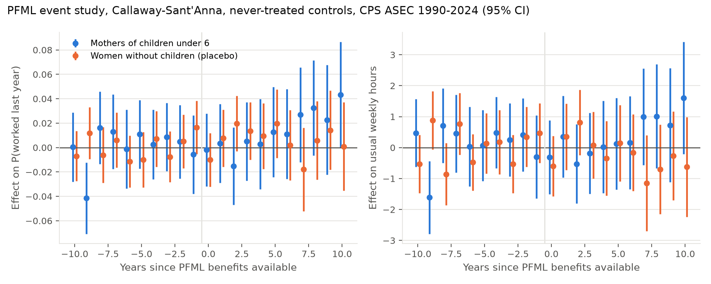
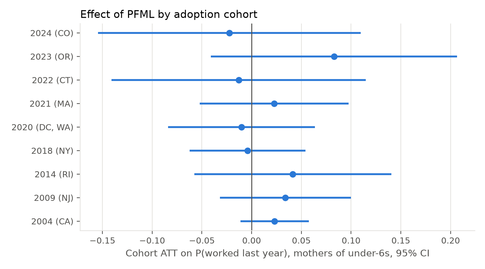
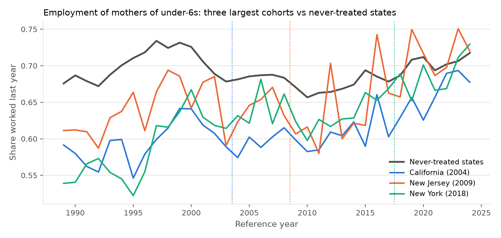

# Results: PFML and mothers' labour supply, CPS ASEC 1990-2025

Data: IPUMS-CPS ASEC extract `cps_00090` (all persons, survey years 1990-2025),
restricted to women aged 18-44: 1,216,812 person-years, reference years
1989-2024, about 10,500 mothers of children under 6 per year. Built by
`python/01_build_ipums_asec.py`; estimated by `02_csdid.py` through
`03_run_all.sh`; assembled by `04_summarise.py`. Tables are in
`output/tables/`, figures in `output/figures/`.

Estimator: Callaway and Sant'Anna (2021) group-time ATTs on repeated cross
sections, cohorts = first reference year with at least six months of PFML
benefits (CA 2004, NJ 2009, RI 2014, NY 2018, WA and DC 2020, MA 2021, CT
2022, OR 2023, CO 2024; DE, MN, MD recoded to never-treated), never-treated
controls (not-yet-treated as a check), no covariates, varying base period,
ASEC person weights. Standard errors: block bootstrap over never-treated states
with within-state resampling of treated cohorts, 499 draws. Stars: * 10%,
** 5%, *** 1%. The Stata `csdid` pipeline (`stata/`) runs the same
design with doubly-robust covariate adjustment and a wild cluster bootstrap.

## 1. Headline

| Sample | Outcome | Simple ATT, never-treated | Simple ATT, not-yet-treated | Mean pre e=-5..-1 | Mean post e=0..5 |
|---|---|---|---|---|---|
| Mothers of under-6s | Worked last year | 0.021 (0.014) | 0.019 (0.013) | 0.004 | 0.001 |
| Mothers of under-6s | Usual weekly hours | 0.53 (0.57) | | 0.18 | -0.09 |
| Mothers of under-6s | Full time | 0.003 (0.015) | | 0.005 | -0.010 |
| Mothers of under-6s | In labour force (March) | 0.024 (0.015) | | 0.003 | 0.010 |
| All mothers | Worked last year | 0.007 (0.009) | | 0.002 | -0.004 |
| All mothers | In labour force (March) | 0.011 (0.009) | | 0.002 | 0.002 |
| Childless women (placebo) | Worked last year | 0.011 (0.010) | | 0.002 | 0.010 |
| Childless women (placebo) | Usual weekly hours | -0.03 (0.50) | | 0.12 | 0.07 |

Paid family leave has no detectable effect on mothers' employment, hours, or
full-time work in the first five years after benefits become available. The
simple ATT on employment is +2.1 percentage points with a standard error of
1.4; the 95 percent interval runs from -0.7 to +4.9 points, so effects larger
than about 5 points are ruled out. Pre-treatment coefficients average 0.004
(employment) and 0.18 hours, so the parallel-trends assumption is not
contradicted, and the childless-women placebo is zero throughout.

## 2. Event study

| Event time | Mothers of under-6s: worked | Mothers of under-6s: hours | Childless: worked |
|---|---|---|---|
| -5 | 0.011 (0.014) | 0.07 (0.59) | -0.010 (0.012) |
| -4 | 0.002 (0.015) | 0.49 (0.59) | 0.007 (0.012) |
| -3 | 0.009 (0.014) | 0.25 (0.60) | -0.008 (0.011) |
| -2 | 0.005 (0.015) | 0.41 (0.60) | 0.005 (0.011) |
| -1 | -0.006 (0.016) | -0.30 (0.68) | 0.017 (0.011) |
| 0 | -0.002 (0.015) | -0.31 (0.61) | -0.010 (0.011) |
| 1 | 0.003 (0.016) | 0.36 (0.67) | 0.008 (0.012) |
| 2 | -0.015 (0.016) | -0.52 (0.66) | 0.020* (0.012) |
| 3 | 0.005 (0.016) | -0.19 (0.67) | 0.014 (0.012) |
| 4 | 0.003 (0.019) | 0.02 (0.76) | 0.009 (0.014) |
| 5 | 0.013 (0.019) | 0.12 (0.76) | 0.020 (0.014) |
| 6 | 0.011 (0.019) | 0.16 (0.77) | 0.002 (0.015) |
| 7 | 0.027 (0.020) | 0.99 (0.80) | -0.018 (0.017) |
| 8 | 0.032 (0.020) | 1.01 (0.86) | 0.006 (0.016) |
| 9 | 0.023 (0.023) | 0.72 (0.94) | 0.014 (0.017) |
| 10 | 0.043* (0.022) | 1.61* (0.93) | 0.001 (0.018) |

The coefficients are flat at zero for the first six years and drift upward
from year seven, reaching +4.3 points on employment and +1.6 hours at year
ten (10 percent level). Event times beyond six are identified only by
California (2004) and New Jersey (2009), and beyond ten by California alone,
so the late rise is a California-and-New-Jersey pattern and not a general
finding. One of twenty pre-period coefficients (e = -9) is significant, as
expected by chance.

## 3. Cohort effects

| Cohort | States | Worked ATT | Hours ATT |
|---|---|---|---|
| 2004 | CA | 0.023 (0.018) | 0.41 (0.74) |
| 2009 | NJ | 0.034 (0.034) | 2.28* (1.31) |
| 2014 | RI | 0.041 (0.051) | 1.88 (2.04) |
| 2018 | NY | -0.004 (0.030) | -0.59 (1.20) |
| 2020 | DC, WA | -0.010 (0.038) | -0.94 (1.49) |
| 2021 | MA | 0.023 (0.038) | 3.03* (1.58) |
| 2022 | CT | -0.013 (0.065) | -2.01 (2.88) |
| 2023 | OR | 0.083 (0.063) | 1.91 (2.51) |
| 2024 | CO | -0.022 (0.067) | -0.89 (3.00) |

No cohort shows a significant employment effect. The first-generation
programmes (CA, NJ, RI) have positive point estimates of 2 to 4 points; the
2018-2024 generation, which is more generous, averages about zero but has
one to six post-years and wide intervals. A precise comparison of programme
generations needs the state-cell heterogeneity analysis in `03_robustness.do`
and more years for the late cohorts.

## 4. Raw means

## 5. What this means for the paper

1. **The extensive-margin null is precise enough to matter.** With nine
   cohorts and 35 years the design rules out employment effects above about
   5 points for mothers of pre-schoolers, and the placebo and pre-trends
   behave. This contrasts with the large short-run effects reported for
   California from birth-timed samples and is consistent with PFML acting on
   leave-taking and job continuity around births rather than on the stock of
   employed mothers.
2. **Where to look next.** (a) Mothers of infants (`has_infant`), where the
   policy bites; (b) the March survey-week outcomes (`inlf`, `employed`,
   `hours_now`) that date labour supply after the leave period rather than
   the calendar year it started; (c) covariate-adjusted `drimp` estimates and
   the wild cluster bootstrap in Stata; (d) the long-run rise in CA and NJ
   against Bailey et al.'s negative long-run findings for first-time mothers;
   (e) programme generosity as a moderator once the policy dates and
   parameters are verified.
3. **Caveats.** Reference-year timing assigns the whole calendar year to a
   cohort whose benefits started mid-year (CA, NJ, DC, OR; the
   `gvar_full` variable carries the first full year as a robustness cohort);
   the policy dates were compiled from memory and must be verified; 2014 has
   two ASEC subsamples that are pooled with their weights; standard errors
   come from a state block bootstrap and should be compared with `csdid`'s
   wild cluster bootstrap.
