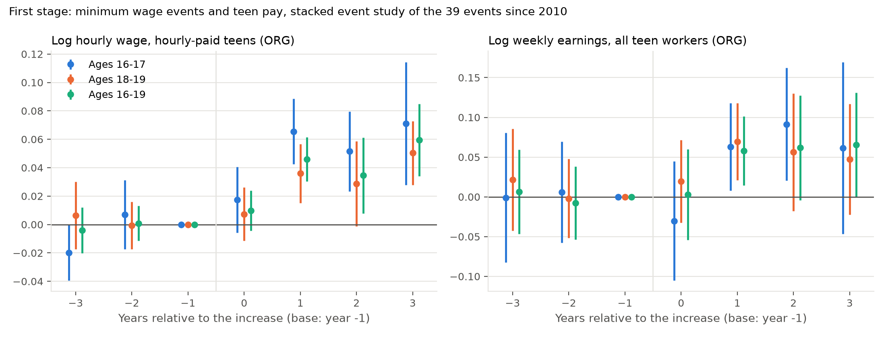
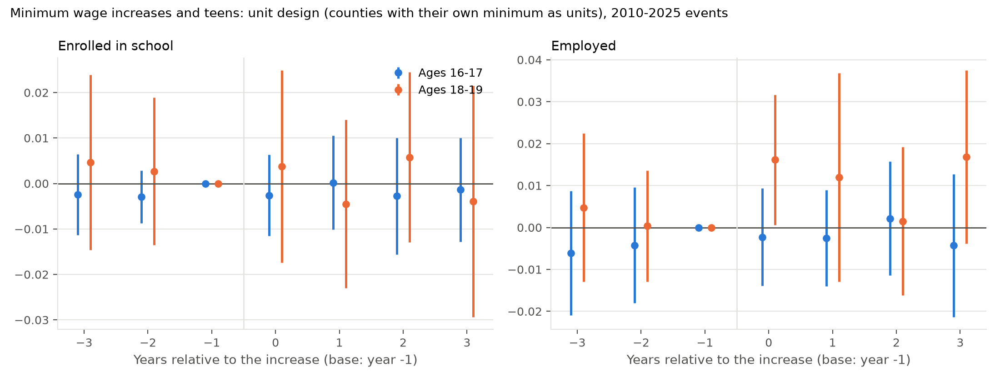
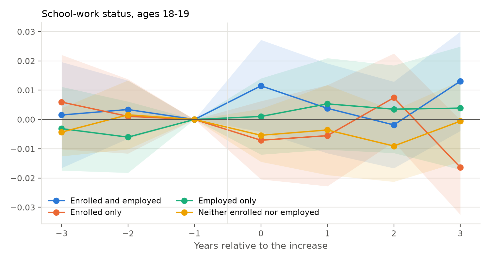

# Minimum wage increases and teen school enrollment: results

Design: `docs/minwage_design.md`. Data: IPUMS-CPS basic monthly, January
1994 to the latest month, ages 16-24 (5.46 million person-months, about
6,600 16-19 year olds a month), built by `python/30_build_cps_monthly.py`.
Events: `python/31_build_mw_events.py` finds 85 state-driven increases of 5
percent or more after a 36-month quiet period, 39 of them from January 2010
on. Estimator: `python/32_stacked_events.py`, the Cengiz et al. stacked
design with the Callaway-Sant'Anna comparison (treated state minus clean
controls, relative to the year before the event), events weighted by the
treated state's teen population, state block bootstrap with 99 draws.
Battery: `python/33_run_minwage.py`; tables: `output/tables/mw_summary.md`.

Main sample: the 39 events from 2010 on. The federal minimum did not change
in this period, so every control (median 24 states per event) is clean in
the strict sense. The events raise the state minimum by 7 to 86 percent over
the four-year window (median 34 percent); 24 of them are multi-step
schedules.

## 0. Main specification (September 13 update): the unit design

The main specification is now the unit design: every identified county with
its own minimum is a geographic unit with its own wage floor (the city's
rate applied to the county) and the rest of each state is another unit
(`python/38_unit_panel.py`); events (73 from 2010 with CPS teens: 39 state
remainders, 34 counties) and clean controls are defined at the unit level.
The state design (39 state events) is the appendix of the paper. Numbers:
`output/tables/mw_summary.md` (tags `*_unit`). The sections below give the
state-design numbers from the first pass; the two agree to within a tenth of
a point on every outcome. Unit design headline: wages of hourly-paid teens
+5.3 percent (s.e. 1.2) at 16-17, +3.0 (0.9) at 18-19; enrollment -0.3
(0.4) and +0.1 (0.9); employment -0.1 (0.5) and +1.0 (0.7); the four
school-work states, hours and participation unchanged.

### Regression counterparts (September 14)

`python/46_regressions.py` (pyfixest) adds, for every outcome x age x
income group, two regression estimates on the 2010-2026 unit-design data,
reported in the paper before each event-study figure
(`paper/tables/tabR*b_*_reg.tex`, numbers in `output/tables/mw_regressions.csv`):

* **TWFE, log minimum wage** (the Neumark-Shupe 2019 / Smith 2021
  specification): y on ln(effective minimum of the teen's unit) with unit and
  year-month fixed effects, age/sex/race/Hispanic controls, survey weights,
  clustered by state. Multiply by 0.32 (ln 1.38) for the average event.
* **Stacked DiD, post x treated** (regression form of Cengiz et al. 2019):
  unit-month cell means stacked over the 73 events with their clean controls
  (-36..+47 months), event-by-unit and event-by-month fixed effects,
  population weights, clustered by state.

Findings. On wages the three agree: TWFE elasticity 0.23 (0.02) at 16-17,
0.16 (0.02) at 18-19, 0.19 (0.02) pooled (7.3 / 5.2 / 6.1 percent for the
average event); stacked +5.0 (0.8), +3.2 (0.8), +4.0 (0.7) percent; event
study +5.3, +3.0, +3.8. On time allocation the stacked coefficients
reproduce the event-study nulls, but TWFE finds a positive effect on
"neither enrolled nor employed" (0.022 (0.007) at 16-17, 0.018 (0.008) at
18-19, i.e. +0.7 / +0.6 points for the average event) and a negative one on
enrollment at 16-17 (-0.021 (0.010)); the same TWFE pattern appears for
high-income teens (0.021 (0.006)) as for low-income (0.019 (0.011)). The
paper attributes the gap to the variation TWFE uses (the whole 2010-2026
path of the minimum against the flat federal-floor states, so long-run
differential trends in the idle share load on the minimum), with the flat
pre-event coefficients of the event design as the check. Adding unit-specific
linear trends to the TWFE removes the "neither" coefficient (0.001 (0.005)
at 16-17) but makes other estimates erratic (employment -0.11 (0.05), log
wage 0.30 (0.03) at 16-19: trends absorb a trending treatment, Meer and West
2016); those numbers are in the csv (`twfe_trend`) and a footnote, not in
the tables.

**Update (September 15): the TWFE enrollment coefficient is a summer-months
effect.** The CPS enrollment item asks about attendance last week; in
June-August it records summer school (63 percent of 16-17 year olds report
enrollment in summer vs 93 percent in school months). On school months
(Sept-May) the TWFE coefficients at 16-17 are enrolled -0.006 (0.010) and
neither +0.006 (0.008), a fifth of the all-months values; in June-August
alone they are -0.067 (0.029) and +0.067 (0.017). What survives in school
months (neither +0.017 (0.006) at 18-19, +0.012 (0.003) pooled) rests on the
comparison of raising units with the federal-floor states: among units whose
minimum changed at all in 2010-2026 the school-months coefficients are
-0.005 (0.017) at 18-19 and +0.008 (0.010) pooled. The wage elasticities are
identical on school months and all months (0.22 vs 0.23 at 16-17). The
main-text regression tables (`tabR*b_*_reg.tex`) now carry the stacked-DiD
coefficient only; the TWFE estimates on school months are in the appendix
(`tabT*_twfe.tex`; all-months TWFE is kept in the csv but not tabulated), and Appendix B of the paper
(`python/47_twfe_diagnostics.py`, `paper/tables/tabA_twfe_diag.tex`,
`output/tables/mw_twfe_diagnostics.csv`) reports the variants: months,
raising units only, region x month FE, 2010-2019, drop 2020-2021, 24-month
lead placebo (no predictive power), unit trends (erratic).

## 1. Headline (state design, first pass)

The increases raised teen pay and changed nothing else. Hourly wages of
hourly-paid 16-17 year olds rise 5.1 percent (s.e. 1.2) and of 18-19 year
olds 3.1 percent (0.9), building from the first year to about 7 percent by
year three. Enrollment does not move: -0.3 points (s.e. 0.4) at 16-17 and
-0.4 (0.9) at 18-19, so the intervals exclude a fall in enrollment of more
than about 1 point at 16-17 and 2 points at 18-19. Employment does not move
either (0.0 (0.5) and +1.3 (0.8)), and neither does any of the four
school-work states. Pre-event coefficients are within a fraction of a point
of zero for every outcome.

Post-event average effect (years 0-3), 2010+ events, from
`output/tables/mw_summary.md`:

| Outcome | 16-17 | s.e. | 18-19 | s.e. |
|---|---|---|---|---|
| Enrolled in school | -0.0034 | 0.0042 | -0.0036 | 0.0090 |
| Enrolled in high school | -0.0067 | 0.0049 | -0.0109 | 0.0067 |
| Enrolled full time | -0.0030 | 0.0044 | -0.0056 | 0.0081 |
| Employed | -0.0001 | 0.0049 | +0.0125 | 0.0079 |
| In labour force | +0.0035 | 0.0051 | +0.0097 | 0.0056 |
| Usual hours | -0.06 | 0.12 | +0.38 | 0.29 |
| Enrolled and employed | -0.0021 | 0.0048 | +0.0063 | 0.0064 |
| Enrolled only | -0.0013 | 0.0056 | -0.0100 | 0.0066 |
| Employed only | +0.0020 | 0.0024 | +0.0062 | 0.0071 |
| Neither enrolled nor employed | +0.0014 | 0.0034 | -0.0026 | 0.0058 |
| Log hourly wage (hourly paid, ORG) | +0.0514 | 0.0122 | +0.0306 | 0.0088 |
| Log weekly earnings (ORG) | +0.0464 | 0.0346 | +0.0482 | 0.0265 |

Pre-period means (treated states, year before the event): enrolled 0.84 at
16-17 and 0.61 at 18-19; employed 0.21 and 0.45.

First stage by event year, log hourly wage of hourly-paid teens (s.e. in
parentheses): ages 16-17, years -3 to 3: -0.020 (0.010), 0.007 (0.012), 0,
0.017 (0.012), 0.065 (0.012), 0.052 (0.014), 0.071 (0.022); ages 18-19:
0.006 (0.012), -0.001 (0.008), 0, 0.007 (0.010), 0.036 (0.011), 0.029
(0.015), 0.050 (0.011). Year 0 is small because the event month falls inside
it and most schedules add their later steps in years 1-3; from year 1 the
wage effect is five to seven standard errors from zero and grows with the
schedule. Weekly earnings of all teen workers rise 6 to 9 percent from year 1
at 16-17 and 5 to 7 percent at 18-19, so hours did not fall enough to offset
the wage.

## 2. Robustness

Every variant of the enrollment estimate is within one standard error of
zero (`output/tables/mw_summary.md`, robustness block):

| Variant, enrolled | 16-17 | s.e. | 18-19 | s.e. |
|---|---|---|---|---|
| Main (39 events, 2010+) | -0.0034 | 0.0042 | -0.0036 | 0.0090 |
| All 71 events, 1994+ | -0.0022 | 0.0026 | +0.0017 | 0.0055 |
| 32 events before 2010 | -0.0010 | 0.0047 | +0.0071 | 0.0073 |
| Large events only (window rise 20%+, 58 events) | -0.0031 | 0.0029 | -0.0041 | 0.0062 |
| Federal-floor controls only | -0.0037 | 0.0042 | -0.0048 | 0.0093 |
| Equal weight per event | +0.0004 | 0.0040 | -0.0073 | 0.0066 |
| Drop 2020-21 | -0.0026 | 0.0032 | -0.0047 | 0.0091 |
| September-May only | -0.0052 | 0.0037 | -0.0069 | 0.0072 |

Employment of 16-17 year olds is -0.9 points (s.e. 0.5) for the large-event
set and zero otherwise. Ages 20-24, where the enrollment margin is weaker,
show the same nothing: -0.2 (0.5) on enrollment, +0.2 (0.5) on employment.
Event by event, 20 of the 39 post-2009 events have a negative enrollment
estimate at 16-17 and 19 a positive one; the three largest by weight
(California 2014, New York 2014, Florida 2021) are -0.3, +0.1 and -2.5
points, and Florida's pre-trend is the same -2.6.

### Substate minimums: the unit design

City and county minimums (Vaghul-Zipperer substate list) are handled by
treating every identified county with its own minimum as a separate unit with
its own effective minimum wage series (a city's rate applied to its whole
county), and the rest of each state as the state unit
(`python/38_unit_panel.py`: 107 units, 56 of them counties). Events are then
defined at the unit level with the same rule (a rise of 5 percent or more
after 36 quiet months, not caused by the federal floor), and each event's
controls are the units in other states with no rise in the window. A Seattle
teen is treated by Seattle's minimum and King County has its own event when
Seattle raises it; a rise in the state rate that also lifts a county unit is
a county event with source "both". From 2010 there are 101 events, 73 with
CPS teens: 39 state-remainder events, 18 county events where state and local
rates rose together (the New York City boroughs, Long Island and Westchester,
Los Angeles, the Bay Area counties, San Diego, Denver, Minneapolis, Flagstaff,
the Portland metro), and 16 county events driven by a local rise alone (San
Francisco, San Jose, Chicago, Seattle, Tacoma, Montgomery and Prince George's
counties, Portland ME, St. Paul, Albuquerque, Las Cruces, Santa Fe, and the
short-lived Iowa and Kentucky county minimums).

| Post-event average | Wage 16-17 | Wage 18-19 | Enrolled 16-17 | Enrolled 18-19 | Employed 16-17 | Employed 18-19 |
|---|---|---|---|---|---|---|
| State design, 39 events (main) | 0.051 (0.012) | 0.031 (0.009) | -0.003 (0.004) | -0.004 (0.009) | -0.000 (0.005) | 0.013 (0.008) |
| Unit design, all 73 events | 0.053 (0.012) | 0.030 (0.009) | -0.003 (0.004) | 0.001 (0.009) | -0.001 (0.005) | 0.010 (0.007) |
| Unit design, state-remainder events (39) | 0.052 (0.014) | 0.028 (0.009) | -0.005 (0.005) | -0.009 (0.010) | 0.004 (0.005) | 0.015 (0.008) |
| Unit design, county events, state and local rise (18) | 0.051 (0.035) | 0.043 (0.017) | 0.005 (0.007) | 0.033 (0.009); pre 0.013 | -0.021 (0.029) | 0.003 (0.023) |
| Unit design, county events, local rise only (16) | 0.085 (0.044) | 0.043 (0.043) | 0.016 (0.017) | 0.075 (0.034); pre 0.053 | -0.016 (0.028) | -0.047 (0.051) |

The unit design reproduces the state design: the wage first stage and the
enrollment and employment nulls are unchanged when the 34 county events are
added, because the state remainders carry most of the weight. The county
events on their own are a different matter. Their first stage is larger
(local increases are bigger) and their enrollment estimates at 18-19 are
positive, +3.3 points (s.e. 0.9) for the county events with both a state
and a local rise and +7.5 (3.4) for local-only events, but so are their
pre-event averages (+1.3 and +5.3): the big-city counties were on a rising
enrollment path relative to other states' units before their increases. Net
of the pre-trend the post-event change is about two points in both sets,
which is at most suggestive. Hours, participation and the four school-work
states are unchanged in the unit design (`output/tables/mw_summary.md`).

The earlier checks, which keep the state design and only clean the control
side or restrict the treated side, are retained in the summary tables
(controls net of local-minimum counties: enrolled -0.004 (0.004) and -0.002
(0.009); treated counties without a local minimum: -0.007 (0.004) and +0.004
(0.010)).

## 3. Heterogeneity (enrolled, 2010+ events)

| Subgroup | 16-17 | s.e. | 18-19 | s.e. |
|---|---|---|---|---|
| Girls | -0.003 | 0.005 | +0.008 | 0.012 |
| Boys | -0.004 | 0.006 | -0.015 | 0.010 |
| Black | 0.000 | 0.014 | +0.039 | 0.027 |
| Hispanic | -0.005 | 0.010 | -0.013 | 0.023 |
| White and other | -0.002 | 0.006 | -0.013 | 0.010 |
| Family income below $50,000 | -0.002 | 0.008 | +0.002 | 0.016 |
| Family income $50,000 or more | -0.004 | 0.004 | -0.005 | 0.012 |

Boys aged 18-19 are the only cell with a point estimate above one point,
and its pre-trend is -2.2, so it is not evidence of anything.

## 4. Reading

This is a precise null with a demonstrated first stage, which is the
combination that makes a null informative. The 2010-2025 increases were
large (a third of the minimum over four years, on average), they raised the
pay of the teens who work, and they did not change whether teens were in
school, whether they worked, or how they combined the two. The result
contradicts the two-way fixed effects estimates in Neumark and Wascher
(1995, 2003) and Neumark and Shupe (2019), who attribute the post-2000 fall
in 16-17 year olds' employment and the shift from "enrolled and employed"
to "enrolled only" mainly to minimum wages. In an event design with clean
controls, the employment of 16-17 year olds does not fall (0.0, s.e. 0.5
points) and the shift to enrolled-only does not occur (-0.1, s.e. 0.6). It
is consistent with Cengiz et al. (2019), who find no employment loss for
low-wage workers as a whole, and extends that to the schooling margin.

Limits. The 2023-2025 minimum wage steps are compiled from memory and must
be verified against the state schedules before the event list is final; the
same holds for the manual index adjustments, which decide which states are
clean controls after 2022. Standard errors come from 99 bootstrap draws and
should be replaced by the Stata wild cluster bootstrap
(`stata/32_stacked_csdid.do`). Enrollment last week is a coarse measure of
schooling: it cannot see grade progression, dropout timing or completion,
so a null here does not rule out effects on attainment measured years
later, which the ACS or administrative data would be needed to test.

### Heterogeneity by sex and race (September 15)

`python/48_run_het.py` (tags `_unit_female/_male/_white/_nonwhite`; white =
non-Hispanic white, `white` flag added to the clean file) and the
corresponding rows of `mw_regressions.csv`. Post-event averages (points):

* Girls 16-17: enrolled-and-employed -1.3 (0.5), employed -1.3 (0.5),
  enrolled-only +1.2 (0.7), enrollment -0.1 (0.5); pre-event averages 0.0.
  Boys 16-17: +0.8 (1.0), +1.2 (0.9), -1.2 (1.0), -0.4 (0.6). The one cell in
  the paper beyond two s.e.; the stacked regression gives -1.3 (0.6) / +1.1
  (0.7) for girls and +1.1 (0.6) / -1.1 (0.6) for boys, and pooling ages the
  sexes offset (boys +1.1 (0.5) enr_emp, girls -0.8 (0.4)). Reported as the
  upper bound of what the design finds: a one-point shift from work-in-school
  to school-only among the youngest girls, enrollment unchanged.
* Race: nothing. White 16-17 shares +0.3/-0.2/+0.2/-0.3; non-white
  -1.2 (0.7)/+0.7/+0.1/+0.3; non-white enrollment -0.4 (0.7) at 16-17,
  +1.2 (1.0) at 18-19.
* Wages: girls 5.4 (1.9) / 3.4 (0.9) / 4.1 (1.0), boys 4.7 (1.7) / 2.5 (1.4) /
  3.5 (1.2); white 4.9 (1.8) / 2.8 (1.3) / 3.6 (1.3), non-white 7.4 (1.6) /
  3.5 (1.4) / 4.3 (1.2).
* TWFE school months: neither at 18-19 is 0.040 (0.010) for white vs 0.000
  (0.007) for non-white teens (the federal-floor residual sits among white
  teens).

### Time window (September 16)

Everything in the paper is now restricted to the window of the main design: 73 events from January 2010 to March 2025, observations January 2007 to August 2026 (3.08 million person-months aged 16-24). The descriptive figures run 2007-2025, the robustness table no longer carries the all-events (1994-2025) and pre-2010 rows, and the text no longer quotes estimates or sample counts from before 2007; the pre-2000 decline in teen employment is mentioned only as background from the published CPS series.

### Stacked DiD with individual controls (September 17)

The paper's stacked-DiD tables now come from `python/51_stacked_controls.py`: cells are unit x month x age x sex x race/ethnicity (non-Hispanic white, Black, Hispanic, other) x CPS family income category, and those categories enter as fixed effects, which is numerically the person-level regression with those dummies (clustered by state). Stacked observations: 6.8M at 16-17, 6.3M at 18-19, 13.1M pooled, from 620k / 554k / 1.17M teen-months. The controls move no school-work coefficient by more than 0.25 points and no wage/earnings coefficient by more than 1.2 points (weekly earnings, low-income 16-17). Results: `output/tables/mw_stacked_controls.csv`; the uncontrolled cell-mean versions remain in `mw_regressions.csv`.
