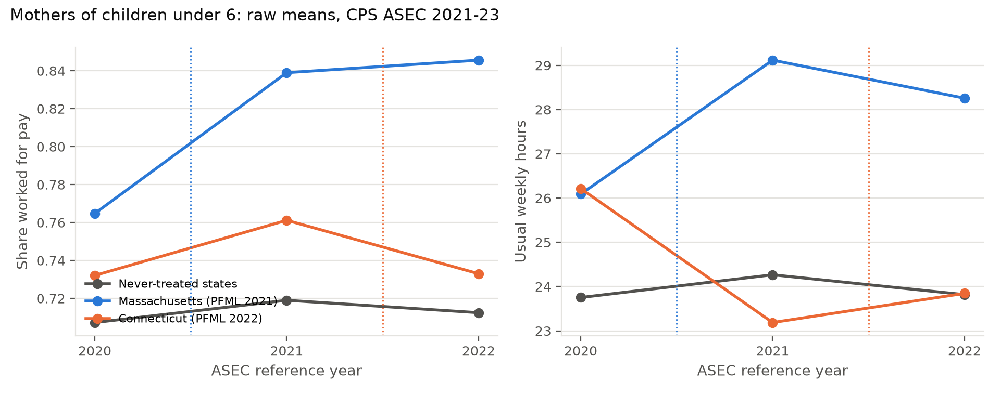
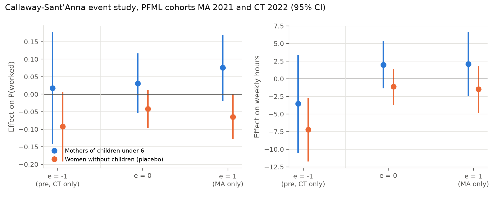

# Preliminary results: PFML and mothers' labour supply, CPS ASEC 2021-23

Produced by `pfml/python/02_csdid_prelim.py`; tables in `pfml/output/tables/`,
figures in `pfml/output/figures/`. Standard errors are from a block bootstrap
over never-treated states with within-state resampling of the two treated
cohorts (499 draws). The `csdid` Python port reproduces every ATT(g,t) to four decimals; its
e = 0 aggregate differs in the third decimal because it weights cohorts by
size across all periods rather than in the base year, and its multiplier-
bootstrap standard errors are implausibly small with 60-150 treated
observations per cell, so they are not used. The Stata do-file
`pfml/stata/90_prelim_csdid.do` runs the same specification with `csdid` and
a state-clustered wild bootstrap.

## 1. Sample and cohorts

Women aged 18-44, CPS ASEC survey years 2021-2023 (reference years 2020-2022),
own children linked within families with 92 percent exact-match retention.
States treated before 2021 (CA, NJ, RI, NY, WA, DC) have no pre-period in the
window and are dropped; OR, CO, DE, MN and MD are not-yet-treated and count as
controls, which is also what `csdid` does with cohorts after the last period.

| Cohort | State | Mothers of under-6s, 2020 / 2021 / 2022 |
|---|---|---|
| 2021 | Massachusetts | 153 / 130 / 110 |
| 2022 | Connecticut | 64 / 67 / 63 |
| never / not yet | 40 states | about 5,000 per year |

## 2. Raw means

Employment of Massachusetts mothers of under-6s rose from 76 to 84 percent
between 2020 and 2021 while never-treated states were flat; Connecticut rose
in 2021, a year before its benefits started, and fell back in 2022.

## 3. Group-time ATTs and aggregations

Mothers of children under 6, outcome: worked for pay in the reference year.

| Estimand | Estimate | s.e. |
|---|---|---|
| ATT(MA 2021, 2021) | 0.063 | 0.051 |
| ATT(MA 2021, 2022) | 0.076 | 0.048 |
| ATT(CT 2022, 2021), pre-period | 0.017 | 0.082 |
| ATT(CT 2022, 2022) | −0.022 | 0.078 |
| Event time −1 (pre) | 0.017 | 0.082 |
| Event time 0 | 0.031 | 0.044 |
| Event time 1 | 0.076 | 0.048 |
| Cohort MA | 0.069 | 0.043 |
| Cohort CT | −0.022 | 0.078 |
| Simple ATT | 0.048 | 0.037 |

## 4. Event studies by sample and outcome

| Sample | Outcome | Pre-mean, treated | e = −1 (pre) | e = 0 | e = 1 | Simple ATT |
|---|---|---|---|---|---|---|
| Mothers of under-6s | Worked | 0.754 | 0.017 (0.082) | 0.031 (0.044) | 0.076 (0.048) | 0.048 (0.037) |
| Mothers of under-6s | Hours | 26.1 | −3.54 (3.54) | 1.98 (1.71) | 2.10 (2.31) | 2.03 (1.60) |
| Mothers of under-6s | Full time | 0.504 | 0.017 (0.090) | −0.004 (0.054) | 0.026 (0.067) | 0.008 (0.049) |
| All mothers | Worked | 0.776 | −0.003 (0.059) | −0.003 (0.033) | 0.040 (0.040) | 0.014 (0.030) |
| Women without children (placebo) | Worked | 0.841 | −0.093* (0.051) | −0.042 (0.028) | −0.065** (0.033) | −0.051** (0.025) |
| Women without children (placebo) | Hours | 27.9 | −7.22*** (2.30) | −1.13 (1.30) | −1.48 (1.70) | −1.27 (1.17) |
| All women 18-44 | Worked | 0.814 | −0.055 (0.040) | −0.026 (0.021) | −0.025 (0.025) | −0.026 (0.019) |

## 5. Reading

* **Point estimates for mothers of young children are positive** (about
  +3 to +8 percentage points on employment, +2 hours) but not distinguishable
  from zero: the treated cells hold 60-150 mothers.
* **The placebo fails.** Childless women in MA and CT show lower employment
  than in never-treated states after adoption, and a significant pre-period
  movement for Connecticut. Nothing in PFML should move childless women's
  employment, so these are state shocks in the pandemic recovery, not policy
  effects. The implied triple difference (mothers minus childless) is larger
  than the raw ATT, about +0.10 at event time 1, and equally noisy.
* **What the window can and cannot show.** It shows the pipeline works, that
  the Callaway-Sant'Anna aggregations behave as expected, and that a
  within-state comparison group is necessary for this policy. It cannot
  estimate the effect of PFML: three pandemic years, two cohorts, and no
  monthly timing. With the IPUMS-CPS basic monthly files (2000-2024) the same
  code runs on roughly 250,000 mothers of under-6s per year, nine cohorts,
  and month-level timing; the minimum detectable effect on participation falls
  from about 10 percentage points here to below 1.

## 6. Next steps

1. Request the IPUMS-CPS extract listed in `pfml/stata/01_build_cps.do` and
   run `00_master.do` in Stata 16.
2. Verify the policy dates in `pfml/data/raw/pfml_policy_dates.csv`.
3. Add the outgoing-rotation-group earnings variables for a wage margin.
4. Decide the headline comparison group after seeing the childless-women
   placebo over the full window.
